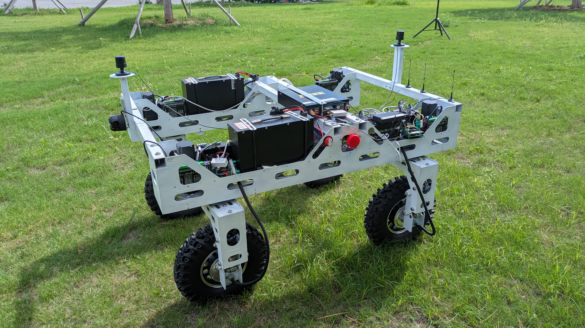

# Beekeeping Mobile Robot


> This project was funded by **Qingdao City University (QCU), China**.



## Introduction

This project develops the autonomous navigation software for a mobile beekeeping robot prototype. It was carried out during a robotics research internship at the Agriculture Robotics Laboratory of Qingdao City University, China. The laboratory focuses on designing autonomous robotic systems to modernize the agricultural sector, particularly in beekeeping and irrigation. The goal of this project was to design the robot's navigation system, successfully bringing both indoor and outdoor autonomous navigation capabilities to the platform. Ultimately, the robot will navigate autonomously to approach beehives and harvest honey using an onboard manipulator arm.

The main ROS 2 package is `bee_mobile` in `robot_ws`. The same workspace also contains the ROS 2 package for the Unitree L2 LiDAR, which includes an integrated IMU. A separate `microros_ws` workspace contains the Micro-ROS tools and agent used to communicate with the robot microcontrollers.

## Stack

- Ubuntu 24.04 Linux
- ROS 2 Jazzy
- Nav2 Jazzy
- Python

## Hardware

The robot is equipped with a comprehensive sensor and mobility suite:
- **Unitree L2 LiDAR** (with integrated IMU)
- **Camera** for visual perception
- **4 independent wheels**, where each wheel is equipped with:
  - 1 brushless motor for traction
  - 1 brushless motor for steering
  - Built-in encoders in the motors
- **2 GPS antennas** for precise outdoor localization (RTK)

## Kinematic Models

The project contains two kinematic models to control the robot:

1. **Swerve Model (Primary)**: The main and best-performing model. It independently controls the steering and drive of all four wheels, allowing highly maneuverable omnidirectional movement.
2. **Ackermann Model (Alternative)**: This mode was developed as a fallback after a hardware failure made one rear wheel impossible to control in the swerve configuration. In agreement with the project supervisor, the Ackermann kinematics were implemented to keep progressing with the robot despite this hardware limitation.

## Installation and Build

### Extract the project

Extract the provided project archive, then enter its root directory:

```text
beekeeping_robot_dev/
├── robot_ws/
└── microros_ws/
```

### Build Micro-ROS Workspace

```bash
cd microros_ws
source /opt/ros/jazzy/setup.bash
colcon build
source install/setup.bash
```

### Build Robot Workspace

Install the dependencies required by the package using the package manifest, then build the workspace:

```bash
cd ../robot_ws
rosdep update
rosdep install --from-paths src --ignore-src -r -y
colcon build
source install/setup.bash
```

## Launching the Project

The robot's onboard computer is accessed remotely via SSH. When visualization is required, RViz is run directly on your local computer.

**Note**: An alias `start_ros` is installed on the robot computer in `~/.bashrc`. This alias automatically sources the ROS 2 environment and both workspaces. You must begin every new terminal on the robot by running `start_ros` to source the ROS 2 environment.

### 1. Start Micro-ROS and the Microcontrollers

In a first terminal on the robot, start the Micro-ROS agent to communicate with the wheel microcontrollers:

```bash
start_ros

start_microros
# or
ros2 run micro_ros_agent micro_ros_agent udp4 --port 8888
```

After starting the agent, disconnect and reconnect the power supply of the microcontroller boards so that the robot detects them. Once detected, power on the motor drivers.

### 2. Launch the Robot Core

In a second terminal on the robot, launch the main robot software. You must specify the `environment` and `kinematics` arguments.

The most developed and best-performing configuration is outdoor navigation with swerve kinematics:

```bash
start_ros

robot_launch
# or
ros2 launch bee_mobile robot.launch.py environment:=outdoor kinematics:=swerve
```

**Launch arguments:**
- `environment`: Choose between `indoor` (uses SLAM/pre-mapped laboratory) or `outdoor` (uses GPS/IMU fusion).
- `kinematics`: Choose between `swerve` (4-wheel independent steering) or `ackermann` (car-like steering).

### Joystick Controls

The deadman trigger (R2/RT) must be held while driving. The left joystick controls forward and backward motion, and the right joystick controls steering or angular velocity.

**Swerve mode:**
- **A**: Selects Straight/Opposite mode.
- **B**: Selects Zero Turn mode.
- **D-pad Up/Left/Down**: Selects slow, normal, and fast speeds, respectively.
- **D-pad Right**: Saves a TASK waypoint when trajectory recording is active.
- **L3 / R3**: Starts / stops trajectory recording.
- **R2/RT**: Deadman trigger (must remain pressed to move).

**Ackermann mode:**
Does not use the A and B mode-selection buttons. The D-pad, L3, R3, and R2/RT functions remain identical to Swerve mode.

### 3. Optional: GPS Monitor

In outdoor mode, you can monitor the GPS and IMU status to ensure you have a high-precision `RTK_FIXED` signal before navigating. Run in a new terminal:

```bash
start_ros
ros2 run bee_mobile gps_monitor
```

### 4. RViz Visualization (Local Computer)

To visualize the robot, sensor data, TF frames, and Nav2 planned trajectories, run RViz on your local computer (ensure it has the same `ROS_DOMAIN_ID` (10 on the robot computer) and is connected to the same network):

```bash
source install/setup.bash
ros2 launch bee_mobile display.launch.py
```
This automatically loads the optimal RViz configuration (`src/bee_mobile/config/robot.rviz`) for the robot.

### 5. Record and Replay an Outdoor Trajectory

You can record outdoor GPS trajectories and replay them for autonomous navigation.

**To record a trajectory:**
Start the recorder manually via terminal (or start it with L3 from the joystick):
```bash
start_ros
ros2 run bee_mobile trajectory_recorder
```
Use D-pad Right to save specific TASK waypoints. The trajectory YAML files are saved in `src/bee_mobile/trajectories/`.

**To replay a trajectory:**
```bash
start_ros
ros2 run bee_mobile gps_mission --ros-args -p trajectory_file:=trajectory_YYYYMMDD_HHMMSS.yaml
```
<h3 style="color: red;">⚠️ Always monitor the robot continuously during replay as the current system does not provide extensive safety handling for GPS drift.</h3>

## Additional Tools

### PID Tuner

The `pid_tuner` node is launched automatically by `robot.launch.py` in non-interactive topology-monitor mode to handle microcontroller reconnections.

If you need to tune the PIDs manually in interactive mode, you must first disable the `pid_tuner` node in `robot.launch.py`. Then, run it separately:

```bash
start_ros
ros2 run bee_mobile pid_tuner --ros-args -p interactive_mode:=true
```

### Data Plotting

For runtime analysis and plotting of ROS topics, you can use PlotJuggler, a fast and powerful visualization tool:

```bash
ros2 run plotjuggler plotjuggler
```

### Docking Nodes (Work In Progress)

The visual docking system using ArUco markers is currently a work in progress. The following nodes can be run standalone to test the docking algorithms and marker detection:

```bash
start_ros
ros2 run bee_mobile aruco_tag_detector
ros2 run bee_mobile docking_controller
ros2 run bee_mobile docking_tests
ros2 run bee_mobile docking_tf_math_tester
```

## Project Structure

### Workspace files

- `src/bee_mobile/package.xml`: ROS 2 package metadata and dependencies.
- `src/bee_mobile/setup.py`: Python package installation and executable entry points.
- `src/bee_mobile/launch/`: Launch descriptions for the complete robot, navigation modes, and RViz visualization.
- `src/bee_mobile/config/`: Configuration files for Nav2, EKF, `twist_mux`, camera, RViz, and debugging.
- `src/bee_mobile/urdf/`: Robot model, links, joints, sensors, and wheel geometry.
- `src/bee_mobile/meshes/`: Visual and collision mesh files.
- `src/bee_mobile/maps/`: Indoor and outdoor navigation maps.
- `src/bee_mobile/trajectories/`: Recorded GPS waypoint files.
- `src/bee_mobile/test/`: Package tests.
- `src/unilidar_sdk2/`: Unitree L2 LiDAR ROS 2 package and SDK integration, including the integrated IMU support.
- `microros_ws/`: Micro-ROS setup, messages, and agent workspace.

### Control and hardware nodes

- `joystick_swerve.py` / `joystick_ackermann.py`: Reads the joystick and publishes commands based on the selected kinematic mode.
- `kinematics_swerve.py` / `kinematics_ackermann.py`: Converts body velocity commands into wheel steering angles and wheel speeds.
- `odometry_swerve.py` / `odometry_ackermann.py`: Estimates odometry based on the selected kinematic mode.
- `wheel_state_converter.py`: Converts encoder data into `JointState` messages for RViz.
- `pid_tuner.py`: Publishes PID coefficients and resynchronizes newly connected wheel microcontrollers.
- `unitree_imu_hotfix.py`: Corrects the Unitree IMU axis mapping before republishing the IMU message.

### GPS and navigation nodes

- `custom_gps_driver.py`: Reads and publishes the GPS data used by the robot.
- `gps_monitor.py`: Displays GPS, IMU, status, frequency, and timing data.
- `gps_mission.py`: Converts GPS waypoints to map poses and sends them to Nav2.
- `trajectory_recorder.py`: Records GPS and IMU poses to YAML trajectories.
- `auto_gps_saver.py`: Saves GPS-related data automatically when configured.
- `previsualization_gps.py`: Provides GPS visualization or preview support.

### Docking nodes (WIP)

- `aruco_tag_detector.py`: Detects ArUco markers and publishes their poses.
- `docking_controller.py`: Runs the docking state machine and sends wheel motion pulses.
- `docking_math.py`: Contains steering, velocity, filtering, and TF2 math helpers.
- `docking_tests.py`: Provides keyboard-driven kinematic and TF2 tests.
- `docking_tf_math_tester.py`: Diagnoses the ArUco normal vector and heading correction.


## Provided Maps and Trajectories

The `src/bee_mobile/maps/` and `src/bee_mobile/trajectories/` directories contain files generated during the development of this project. They are left in the repository as they might be useful examples or references.

However, there is no guarantee that they will work perfectly out-of-the-box for your specific setup. Feel free to use them if they work for you, otherwise, you can safely delete them and generate your own maps using SLAM and your own trajectories using the `trajectory_recorder` node.

## Context and Credits

This project was developed as part of the Beekeeping Robot project. Its goal is to provide a mobile robotic platform able to navigate indoor and outdoor environments, use GPS and LiDAR-based localization, and dock with a target using visual markers.

Project name: Beekeeping Robot

Author: Jules GUIGNARD

Supervisor: Mourad BOUZIT

Internship period: April 23 to July 18, 2026

Host laboratory: Agriculture Laboratory, Qingdao City University, China.